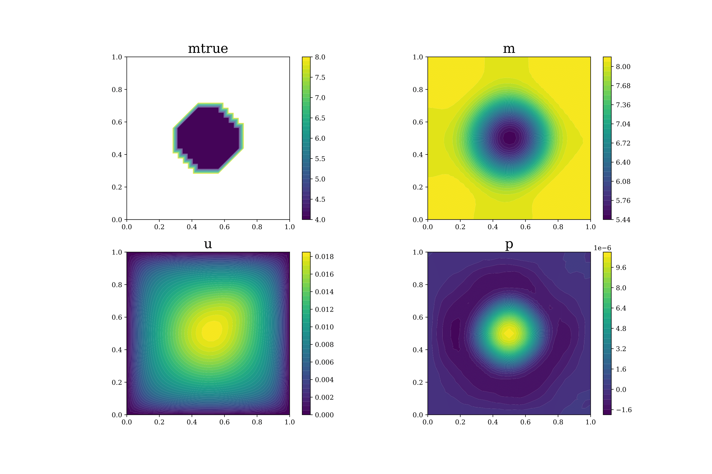

# Computational-and-Variational-Methods-for-Inverse-Problems
## Author
- Mohammad Afzal Shadab (mashadab@utexas.edu)

## Affiliation
Oden Institute for Computational Engineering and Sciences / Jackson School of Geosciences / University of Texas Institute for Geophysics
The University of Texas at Austin

## 2-line Summary
This repo has all the codes which became a part of the assignments for inverse modeling course

### Dependences

The codes requires the following packages to function:
- [Python](https://www.python.org/) version 3.5+
- [Jupyter](https://jupyter.org/)
- [Numpy](http://www.numpy.org/) >= 1.16
- [scipy](https://www.scipy.org/) >=1.5
- [matplotlib](https://matplotlib.org/) >=3.3.4
- [FEniCS](https://fenicsproject.org/download/)
- [hiPPylib](https://hippylib.github.io/#latest-release) version 3.3.0

### Quick Usage
After cloning the repository and installing the required libraries, run the jupyter notebook (.ipynb) or python files (.py) files given in the separate folders. Python codes can be run either directly or on an IDE such as Anaconda Spyder.

## Acknowledgement
I would like to acknowledge Professor Omar Ghattas for teaching the course on 'Computational and Variational Methods for Inverse Problems' in 2021 and providing some basic codes to get started. His open-source review paper with Professor Karen Willcox has most of the theory circumscribing these codes which can be found [here](https://www.cambridge.org/core/services/aop-cambridge-core/content/view/C072A4B417F8C3873ED75C1D63BBB31D/S0962492921000064a.pdf/learning-physics-based-models-from-data-perspectives-from-inverse-problems-and-model-reduction.pdf).

## Solving the Advection-Diffusion-Reaction Inverse problem for diffusion field m ([Homework 4](https://github.com/mashadab/Computational-and-Variational-Methods-for-Inverse-Problems/blob/main/HW4-Hessian-action/Provided/HW4_afzal.pdf) and [Homework 5](https://github.com/mashadab/Computational-and-Variational-Methods-for-Inverse-Problems/blob/main/HW5-transient-NewtonCG/HW5_afzal_final.pdf))

                                            

